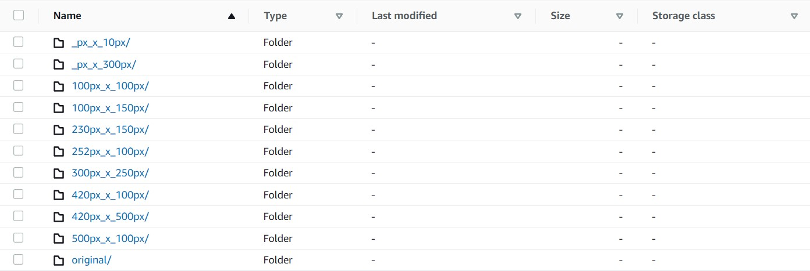
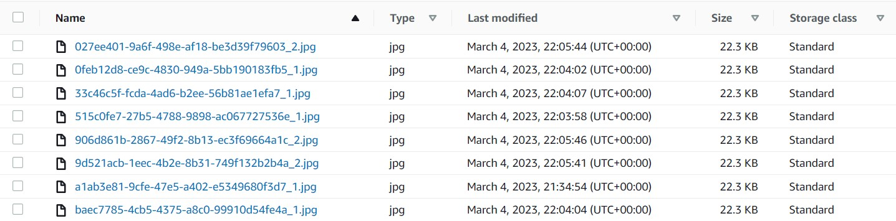

# File transfer app

The program allows you to upload modified files to the AWS S3 server

## Features
- user authorization made via JWT Token
- files will be stored on AWS S3
- application with three subscription tiers Basic, Premium, Enterprise
- the application allows you to create custom subscriptions by an admin
- the application, based on the subscription, resizes the images and sends them to the AWS S3 server
- the original image will always be stored on the server
- the ability to generate links that expire after time
- WSGI server Gunicorn and reverse-proxy server Nginx were added to the project
- Celery clusters can be displayed via Flower at the link http://127.0.0.1:5555/
- postgres database has been implemented

## AWS S3 Folder Structure


## AWS S3 File Structure


## Prerequisites
Make sure you have the following installed on your computer:
- Docker

## Requirements
- django = "4.1.7"
- djangorestframework = "3.14.0"
- djangorestframework-simplejwt = "5.2.2"
- python-dotenv = "1.0.0"
- gunicorn = "20.1.0"
- psycopg2-binary = "2.9.5"
- pytest = "7.2.1"
- pytest-django = "4.5.2"
- faker = "17.5.0"
- pillow = "9.4.0"
- django-storages = "1.13.2"
- boto3 = "1.26.83"
- pytest-mock = "3.10.0"
- celery = "5.2.7"
- flower = "1.2.0"
- redis = "4.5.1"

## Setup
Set data for AWS S3 in the .env file
```bash
$ AWS_ACCESS_KEY_ID
$ AWS_SECRET_ACCESS_KEY
$ AWS_STORAGE_BUCKET_NAME
```

Create and start containers
```bash
$ docker-compose up -d --build
```

Check the container logs
```bash
$ docker-compose logs -f
```

Check a container id
```bash
$ docker ps -a
```

Stop containers
```bash
$ docker-compose stop
```


## Documentation
Postman Documentation
[Documentation](https://documenter.getpostman.com/view/23760886/2s93JnUmbh)

## Running Tests
To run tests, run the following command
```bash
$ docker exec -it <container_web_id> pytest
```